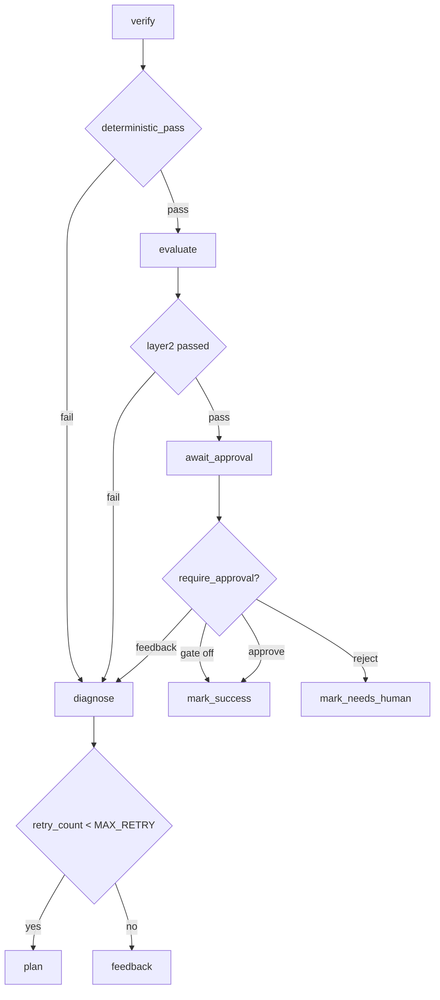

# Phase 6 — Persistence + Approval HITL + Observability + MCP

Day 6 in [docs/project-plan.md](docs/project-plan.md) (lines 1313-1531). Definition of Done: `Agent Run -> Checkpoint -> Pause -> Human Approval -> Resume -> Finish`, provable across a process kill. Stretch: approval feedback re-enters `diagnose`.

Decisions confirmed: `SqliteSaver` from `langgraph-checkpoint-sqlite`; MCP is the official `mcp` SDK as a stdio server plus a client adapter and demo, with live V1/V2 still calling tools directly.

## Preconditions worth fixing first

[requirements.txt](requirements.txt) declares `langgraph>=0.2,<1` and `langchain-core>=0.3,<1`, but the environment runs langgraph 1.2.11 / langchain-core 1.5.5. The `interrupt()` + `Command(resume=...)` API this phase depends on is the 1.x shape, so correct the pins to `>=1,<2` in Step 1 rather than writing code against a range that was never installed.

## Why resume is feasible at all

Three existing invariants make this cheap, and the plan leans on all three:

- `AgentState` is deliberately JSON-serializable; runtime objects (`client`, `sandbox`, `progress`, `feedback_provider`) live only in `configurable` and are asserted absent from state by [tests/test_state_contracts.py](tests/test_state_contracts.py). So checkpoints need no custom serde, and resume just re-injects `configurable`.
- The benchmark worktree is a host bind mount, and `reset_repo` runs only at solve start ([eval/runner.py](eval/runner.py) line 294). The agent's patch therefore survives a process kill. **Resume must never call `reset_repo`** — that is the load-bearing rule of Step 3.
- `SandboxRunner` holds no state beyond counters, so resume can create a fresh container over the same repo path.

## Target topology

`await_approval` is always in the graph but is a pass-through unless `configurable["require_approval"]` is set. That keeps one topology (no singleton explosion across v1/v2 x approval) and leaves `compare` and every existing automated solve on the current path.

## Step details

### 1. Durable checkpointer + session registry

- Add `langgraph-checkpoint-sqlite`, fix the two stale pins.
- New `harness/checkpoint.py`: `open_checkpointer(path=runs/checkpoints.sqlite)` wrapping `SqliteSaver.from_conn_string`.
- New `eval/session.py`: `RunSession` (`run_id`, `thread_id`, `task_id`, `harness`, `model`, `embedder_name`, `query_mode`, `repo_path`, `base_commit`, `status`, `created_at`) persisted to `runs/sessions/{run_id}.json`. A subdirectory is safe because [eval/report.py](eval/report.py) uses non-recursive `RUNS_DIR.glob("*.json")`.
- [agent/graph.py](agent/graph.py): `build_graph(*, include_retrieve=False, checkpointer=None)` -> `graph.compile(checkpointer=checkpointer)`. Leave `get_graph()` / `get_v2_graph()` compiling without a checkpointer so current callers are byte-identical.
- Extract the `configurable` dict from `run_workflow` (lines 250-268) into `build_runtime_config(...)` so solve and resume cannot drift, and set `recursion_limit` explicitly — worst-case node visits already reach ~20 against the default of 25, and approval adds more.

Tests: a checkpoint exists after each node; state reloads from a *fresh* saver instance against the same file; session round-trip.

### 2. Approval node and interrupt routing

- New `agent/nodes/approve.py::await_approval(state, config)`: if `configurable(config).get("require_approval")` is falsy, return `{}`; otherwise build the review payload and call `interrupt(payload)` from `langgraph.types`. Payload carries issue, plan, changed files, diff, test result, evaluator result — the six things the CLI must show.
- `route_after_evaluate` pass branch changes from `mark_success` to `await_approval`; add `route_after_approval` -> `mark_success` | `mark_needs_human` | `diagnose`.
- New state fields: `approval_decision`, `approval_history`. Statuses: `waiting_approval`, `approved`, `rejected`, `approval_feedback`.
- Raise a clear error if `require_approval` is on without a checkpointer, since `interrupt()` needs one.
- Encode one interaction explicitly: routing feedback to `diagnose` increments `retry_count`, so if the budget is already spent, `route_after_diagnose` sends it to `feedback` and then escalates. That is the intended mechanical outcome, not a bug.

Tests (mocked, no CLI): gate off goes straight to `mark_success` (this is the regression guard for `compare`); gate on interrupts with the full payload; approve / reject / feedback each route correctly; budget-exhausted feedback escalates.

### 3. Split `solve_task` so a run can pause and be finished by a later process

[eval/runner.py](eval/runner.py) currently does reset -> sandbox -> harness -> gold -> record in one function. Extract the gold-scoring and record-building tail (lines 361-446) into a shared helper, then:

- `solve_task(..., require_approval=False, checkpoint=False)` writes a `paused` session and returns without a run JSON when the graph interrupts.
- New `resume_task(run_id, *, decision, feedback=None)`: load session -> **no reset** -> verify worktree is still on `base_commit` with the patch present -> new `SandboxRunner` -> `invoke(Command(resume=decision), config)` -> gold -> record.
- New record keys: `run_id`, `thread_id`, `approval_decision`, `resumed`, `resume_count`, `sandbox_sessions`. Note in the doc that sandbox counters restart per container.
- V0 path untouched.

Tests: pause, then finish via a fresh saver and a fresh `resume_task` call (simulating the restarted process); gold still scored independently; paused runs produce no premature `runs/*.json`.

### 4. CLI review view and approval commands

[cli.py](cli.py) is argparse + Rich, and `sandbox doctor` already establishes the nested-subcommand pattern.

- `solve --require-approval` (implies checkpointing) and `--pause-on-approval` for the durable demo.
- `runs` to list paused sessions; `review <run_id>` to render the six panels; `resume <run_id> --approve | --reject | --feedback "..."`.
- Put `format_review(...)` next to the existing formatters in [harness/progress.py](harness/progress.py) (or a new `harness/review.py`), following `format_recovery_summary` / `format_plan_detail`.

Tests: formatter units, plus `cli.main([...])` integration with a mocked runner, as [tests/test_runner.py](tests/test_runner.py) already does.

### 5. Node-level trajectory observability

[agent/state.py](agent/state.py) lines 107-144 already hold a commented-out `WorkflowTraceEvent` / `workflow_trace` placeholder — implement it rather than inventing a parallel sink.

- Append one event per node visit via a helper beside `merge_telemetry` in [agent/nodes/_runtime.py](agent/nodes/_runtime.py): node, status, detail, retry_count, token delta, timestamp. Retries append, never overwrite.
- Persist `workflow_trace` and the reached checkpoint stages in the run JSON; map the five plan-named stages (`Issue analyzed`, `Plan generated`, `Patch generated`, `Tests executed`, `Waiting approval`) onto the `analyze` / `plan` / `execute` / `verify` / `await_approval` boundaries — per-node checkpointing gives all five for free.
- Reconcile against the Day 6 JSON shape: every key already exists except that `retrieval_calls` is V2-only today; decide whether to always emit it.

Risk to measure here: the 009-class run carried 245k tokens and `telemetry.messages` holds raw message dicts, so checkpoint rows can get large. Record the sqlite size in the phase doc and decide whether to keep `messages` out of the checkpointed state.

### 6. Minimal MCP server, client adapter, and phase doc

- New `harness/mcp_server.py` and `harness/mcp_client.py`. Flat modules under `harness/` deliberately: a top-level `mcp/` package would shadow the installed `mcp` SDK, and `harness/` is inside the subprocess audit's scope, which keeps us honest.
- Expose `read_file`, `search_code`, `git_diff`. The first two wrap the existing host-side path-jailed functions in [agent/tools/filesystem.py](agent/tools/filesystem.py) and [agent/tools/search.py](agent/tools/search.py). `git_diff` needs a live sandbox (`git_diff(repo_path, *, sandbox)` raises without one), so create a `SandboxRunner` lazily on first call and tear it down at shutdown; return a clean error when Docker is not ready.
- Because `sandbox/runner.py` delegates Docker to `sandbox/image.py::run_docker`, the server never imports `subprocess` and [tests/test_subprocess_audit.py](tests/test_subprocess_audit.py) stays green without touching its allowlist.
- `cli.py mcp serve` and `cli.py mcp demo` to show `Agent -> MCP Client -> MCP Server -> Tool`. Live V1/V2 tool dispatch is unchanged.
- Write `docs/PHASE6.md` in the [docs/PHASE5.md](docs/PHASE5.md) format (goal, what we built, live evidence, test evidence, observations, out of scope, reproduce) and update the [AGENTS.md](AGENTS.md) lines that currently say checkpoint / approval HITL / MCP "remain Day 6".

Tests: tool listing and schemas, in-process invocation with a fake sandbox, one real stdio round-trip.

## Guardrails

- Gold `success` stays the only resolve metric; approval decisions must not touch it. An approved run whose gold fails is still a failure.
- No benchmark or `eval/gold/` edits; keep the worktree at `base_commit` except for the deliberate resume case.
- `compare` keeps running V0 then V1 with no approval and no interactive recovery.
- Existing suite (293 passed, 2 skipped non-docker; 10 docker) must stay green at every step.