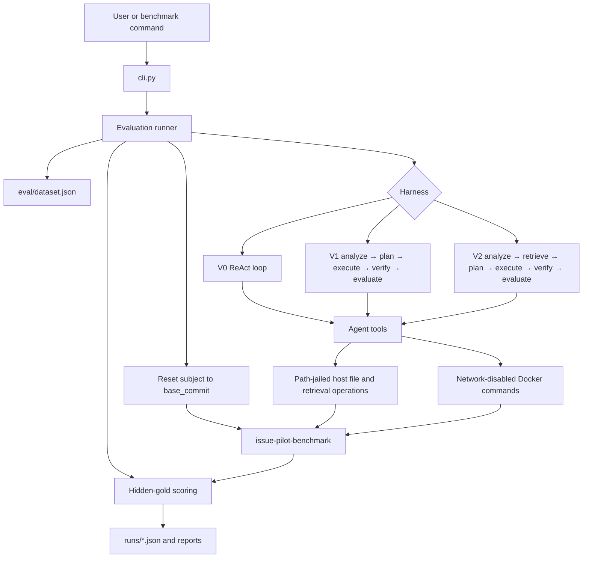
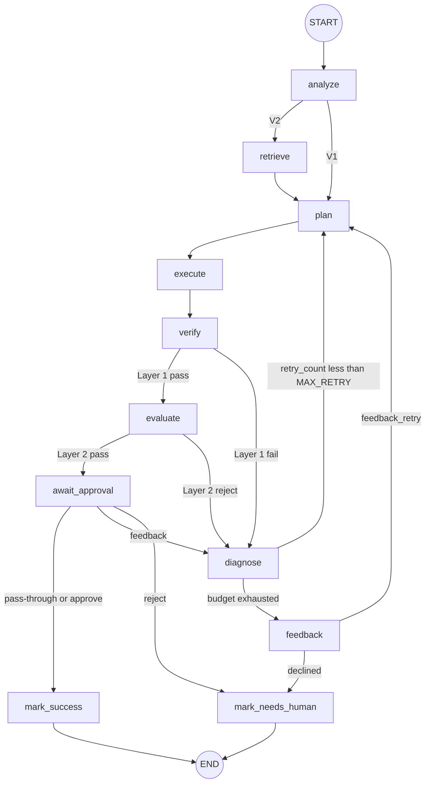

# IssuePilot

IssuePilot is an **evaluation-driven coding-agent harness**. It runs the same
model, task, sandbox, and budget through three increasingly structured
workflows so you can measure whether planning, verification, retrieval, and
retry actually change software-engineering outcomes.

| Harness | Control flow | Extra tools |
| --- | --- | --- |
| **V0** | Minimal ReAct coding loop | Six base tools |
| **V1** | LangGraph Plan-Execute with verify, evaluate, and recovery | Same six tools |
| **V2** | V1 plus hybrid retrieval | Base tools + `search_code` |

The buggy FastAPI subject lives in a **sibling repository**,
[`issue-pilot-benchmark`](https://github.com/wbh123456/issue-pilot-benchmark).
That split keeps hidden gold tests out of the agent's worktree.

> **Status:** the seven-phase MVP is complete. The main finding is not that
> more orchestration always wins: V2 improved a small retrieval-focused
> ablation, while V1 did not beat the cheaper V0 baseline.

## Table of contents

- [Why this project exists](#why-this-project-exists)
- [Features](#features)
- [Quick start](#quick-start)
- [Architecture](#architecture)
- [Harness versions](#harness-versions)
- [Agent tools and safety](#agent-tools-and-safety)
- [Hybrid code retrieval](#hybrid-code-retrieval)
- [Human-in-the-loop](#human-in-the-loop)
- [Evaluation design](#evaluation-design)
- [Command reference](#command-reference)
- [Results](#results)
- [Limitations](#limitations)
- [Development](#development)

## Why this project exists

Coding agents are often scored as one opaque system: one model, one prompt,
one pass/fail. That hides whether a gain came from the model, the tools, the
planner, retrieval, retry logic, or the test suite.

IssuePilot holds the model, temperature, sandbox image, step budget, benchmark
revision, and scoring rules fixed, then changes only the harness. That makes
questions like these measurable:

- Does planning raise hidden-test resolve rate?
- Does retrieval find files that lexical search misses?
- Do deterministic verification and diagnosis produce useful recoveries?
- What do those features cost in tokens, tool calls, file reads, and latency?
- Is a failure caused by retrieval, planning, patching, evaluation, the
  environment, or the benchmark itself?

This repo is a **controlled eval harness**, not a general coding agent you
point at an arbitrary GitHub issue.

## Features

- Three comparable harnesses: ReAct, Plan-Execute, and Plan-Execute + RAG
- Structured plans, diagnoses, patch evaluations, and checkpoint-safe state
- Seven coding tools with path jails, command allowlists, and bounded output
- Network-disabled Docker execution with no host fallback for test commands
- Deterministic verification plus an LLM patch-quality gate
- Automatic diagnose-and-replan recovery and optional human feedback
- Optional approval interrupts with SQLite checkpoints and resumable sessions
- AST-aware hybrid retrieval (BM25 + dense vectors + reciprocal-rank fusion)
- Visible task tests plus hidden gold tests the agent never sees
- Reproducible matrices, retrieval ablations, telemetry, and cohort reports
- A small stdio MCP demo for `read_file`, `search_code`, and `git_diff`

## Quick start

### Prerequisites

- Python 3.12
- Docker Engine or Docker Desktop
- A DeepSeek API key
- This repository and [`issue-pilot-benchmark`](https://github.com/wbh123456/issue-pilot-benchmark)
  checked out as siblings

The benchmark must stay at the `base_commit` recorded in `eval/dataset.json`
(currently Benchmark v4, `f7dbd4000d94dc5aab3835698dc3cb3bbd3eabc7`). A normal
`solve` resets that worktree. Do not keep unrelated work there, and never
commit an agent-generated patch into the benchmark.

### Clone

```bash
git clone https://github.com/wbh123456/issue-pilot.git
git clone https://github.com/wbh123456/issue-pilot-benchmark.git
cd issue-pilot
```

The harness expects the subject at `../issue-pilot-benchmark`.

### Install

```bash
python -m venv .venv
source .venv/bin/activate          # Windows: .venv\Scripts\activate
python -m pip install -r requirements.txt
cp .env.example .env               # Windows: copy .env.example .env
```

Set `DEEPSEEK_API_KEY` in `.env`. Optional overrides:

```dotenv
DEEPSEEK_API_KEY=sk-your-key-here
DEEPSEEK_BASE_URL=https://api.deepseek.com
DEEPSEEK_MODEL=deepseek-v4-flash
```

### Build the sandbox and run tests

```bash
python cli.py sandbox doctor
python cli.py sandbox build
python -m pytest tests -q -m "not docker"
```

### Run the agent

```bash
# V0 ReAct (default)
python cli.py solve issue-001

# V1 Plan-Execute
python cli.py solve issue-001 --harness v1

# V2 Plan-Execute + hybrid retrieval
python cli.py solve issue-016 --harness v2

# Offline retrieval eval (no LLM)
python cli.py retrieve issue-015 --embedder hashing

# Controlled matrix and aggregate report
python cli.py bench --split ablation --harness v0,v1,v2 --n 1 --log
python cli.py report --split ablation --latest-per-cell
```

## Architecture

IssuePilot uses two repositories and three execution boundaries.

| Component | Location | Responsibility |
| --- | --- | --- |
| Harness | This repository | Workflows, tools, policy, retrieval, evaluation, reports |
| Subject | `../issue-pilot-benchmark` | Buggy FastAPI app, visible tests, patch worktree |
| Sandbox | Docker (`issue-pilot-sandbox:py312`) | Allowlisted pytest / ruff / mypy / git commands |
| Gold evaluator | `eval/gold/` | Hidden tests staged only after the agent run |



### Solve lifecycle

1. `eval/runner.py` loads a task from `eval/dataset.json`.
2. The trusted evaluator resets the benchmark to the task's `base_commit`.
3. `SandboxRunner` starts one hardened container with the benchmark mounted at
   `/workspace`.
4. The selected harness analyzes the issue, uses tools, and edits the subject
   worktree.
5. V1/V2 run verification and recovery gates.
6. After the harness finishes, the evaluator copies the hidden gold test into
   `tests/_gold/`, runs it, and deletes it.
7. The runner writes a timestamped JSON artifact under `runs/`.

An approval-interrupted run pauses **before** gold scoring and writes a
session sidecar. Resume does **not** reset the benchmark, because that would
destroy the patch under review.

## Harness versions

`harness_version` selects control flow. It does **not** select a different
sandbox. All versions share the same Docker runtime and gold scorer.

| Version | Control flow | Tool surface | Purpose |
| --- | --- | --- | --- |
| V0 | ReAct loop, up to 15 executor steps | Six base tools | Cheap baseline |
| V1 | `analyze` → `plan` → `execute` → `verify` → `evaluate` → `diagnose` / `feedback` | Same six tools | Planning, verification, retry |
| V2 | V1 with `retrieve` between `analyze` and `plan` | Base tools + `search_code` | Hybrid localization |

### V0: ReAct baseline

`agent/loop.py` alternates model responses and tool results until the model
submits an answer, hits the 15-step limit, or fails. V0 has no planner,
verifier, evaluator, retrieval node, or workflow retry. Hidden-gold scoring
still runs after the loop, so V0 is directly comparable with V1 and V2.

### V1 / V2: LangGraph workflow

`agent/graph.py` compiles a serializable state machine. Every V1/V2 run visits
the same nodes except `retrieve`, which exists only on V2 (between `analyze`
and `plan`). An evaluator reject does **not** re-run `retrieve`.

Happy path:

```text
START → analyze → [retrieve] → plan → execute → verify → evaluate
      → await_approval → mark_success → END
```

Recovery path:

```text
verify / evaluate fail → diagnose
  ├─ retry_count < 2  → plan → execute → …
  └─ else             → feedback
                          ├─ human hint → plan → execute → …
                          └─ declined   → mark_needs_human → END
```



| Node | File | LLM? | Role |
| --- | --- | --- | --- |
| `analyze` | `agent/nodes/analyze.py` | Yes | Restate the issue and form a hypothesis. No tools, no edits. |
| `retrieve` | `agent/nodes/retrieve.py` | No | V2 only. Hybrid search over `app/**/*.py`; writes `relevant_files` and `retrieved_context`. |
| `plan` | `agent/nodes/plan.py` | Yes | Emit a validated `StructuredPlan` (`problem`, `hypothesis`, `files_to_inspect` ≤ 8, 3–5 `steps`). V2 grounds the planner in retrieved snippets. |
| `execute` | `agent/nodes/execute.py` | Yes | ReAct tool loop (same as V0) with plan, diagnosis, and retrieved snippets in `workflow_context`. |
| `verify` | `agent/nodes/verify.py` | No | Layer 1: visible pytest + ruff + non-empty git diff. |
| `evaluate` | `agent/nodes/evaluate.py` | Yes | Layer 2 LLM-as-judge. Pass/fail is computed from `PatchEvaluation`. |
| `await_approval` | `agent/nodes/approve.py` | No | Pass-through unless `--require-approval`; then interrupt with a review bundle. |
| `diagnose` | `agent/nodes/diagnose.py` | Yes | Structured failure analysis and increment `retry_count`. |
| `feedback` | `agent/nodes/feedback.py` | No | Opt-in human hint after the automatic retry budget (`--interactive-recovery`). |
| `mark_success` | `agent/graph.py` | No | Terminal status `success`. |
| `mark_needs_human` | `agent/graph.py` | No | Terminal status `needs_human`. |

Workflow state includes the issue, analysis, structured plan, retrieved files,
test result, patch evaluation, diagnosis, attempt history, retry counters,
human decisions, telemetry, and an append-only workflow trace. Runtime-only
objects such as the model client and sandbox stay outside state so checkpoints
remain JSON-serializable.

### Verification and recovery

**Layer 1 is deterministic.** A patch passes only when:

1. The task's visible pytest command passes.
2. Ruff passes.
3. The git diff is non-empty.

Ruff autofix runs only on Python files the agent touched. Whole-package
`--fix app` used to dirty unrelated files and distort patch-quality metrics.

**Layer 2 is an LLM patch evaluator with a mechanical decision rule.** The
model returns a structured `PatchEvaluation`; code computes pass only when:

- `issue_resolved` is true
- `patch_scope` is `appropriate`
- `regression_risk` is `low`
- `missing_tests` is false

A Layer 1 failure or Layer 2 rejection enters structured diagnosis and
replanning. `MAX_RETRY=2` means one initial execution plus one automatic
replan after the first failed attempt. After that, `--interactive-recovery`
can accept one human hint before the workflow escalates to `needs_human`.

The hidden gold test is independent of both layers. The agent never receives
gold output, and a gold-correct patch can still be rejected by Layer 2.

## Agent tools and safety

| Tool | Available in | Purpose | Boundary |
| --- | --- | --- | --- |
| `list_files` | V0/V1/V2 | List repository paths | Host, path-jailed |
| `read_file` | V0/V1/V2 | Read bounded file content | Host, path-jailed |
| `grep_code` | V0/V1/V2 | Lexical search across the repository | Host, path-jailed |
| `edit_file` | V0/V1/V2 | Apply targeted text edits | Host, path-jailed |
| `run_tests` | V0/V1/V2 | Run the task's test command | Docker |
| `git_diff` | V0/V1/V2 | Inspect the current patch | Docker |
| `search_code` | V2 only | Hybrid semantic and lexical code search | Host, path-jailed |

The container runs as a non-root user with:

- no network
- a read-only root filesystem
- a temporary `/tmp`
- all Linux capabilities dropped
- `no-new-privileges`
- one read/write mount for the benchmark at `/workspace`

Agent commands are parsed as argv, not a shell string. The allowlist covers
`pytest`, `ruff`, `mypy`, and `git status` / `git diff`. Shell metacharacters
are rejected. Commands time out after 60 seconds, tool payloads are capped at
10,000 characters, and there is no host fallback for container commands.

Filesystem and retrieval tools run on the host against a strict repository
path jail. Docker protects command execution; the path jail protects host-side
file access.

## Hybrid code retrieval

V2 builds an in-memory index over `app/**/*.py` in the benchmark:

```text
Python source
  → AST chunks (module, class, function, method)
  → BM25 lexical ranking + dense cosine ranking
  → reciprocal-rank fusion (RRF k=60)
  → top 5 files and bounded snippets for the planner
```

- The retrieve node is deterministic and uses no LLM call.
- Live V2 defaults to the dependency-free hashing embedder and issue-only
  queries (`--embedder hashing --query-mode issue`).
- `python cli.py retrieve` defaults to FastEmbed and can compare `grep`,
  `bm25`, `dense`, and `hybrid` without calling the model.
- The offline grep baseline is restricted to `app/**/*.py` to match the index
  corpus; the agent's `grep_code` tool still searches the whole repository.
- `search_code` is available during V2 execution when issue language does not
  match identifiers.
- The index is rebuilt rather than persisted, so edits cannot serve stale
  chunks. The cost is repeated indexing work.

Retrieval quality is file-level `recall_at_5`. That is a localization metric,
not a substitute for hidden-gold resolve.

See [docs/PHASE4-architecture.md](docs/PHASE4-architecture.md) for the design
trade-offs.

## Human-in-the-loop

Human intervention is opt-in and serves two different purposes:

1. `--interactive-recovery` asks for one same-process hint after automatic
   recovery is exhausted.
2. `--require-approval` interrupts a V1/V2 run after both workflow layers
   pass and presents the issue, plan, patch, test result, evaluator result,
   and trace for review. `--pause-on-approval` implies `--require-approval`
   and writes a paused session, then exits so you can `review` / `resume`
   later.

Approval uses LangGraph's SQLite checkpointer at `runs/checkpoints.sqlite`.
Paused session metadata lives under `runs/sessions/`.

```bash
python cli.py solve issue-001 --harness v1 --require-approval
python cli.py solve issue-001 --harness v1 --pause-on-approval
python cli.py runs
python cli.py review <run_id>
python cli.py resume <run_id> --approve
python cli.py resume <run_id> --reject
python cli.py resume <run_id> --feedback "Drop the unrelated edit"
```

`await_approval` is a pass-through unless approval is required. `compare` and
`bench` do not enable approval or interactive recovery. Gold `success` is
independent of approve/reject.

## Evaluation design

### Dataset

`eval/dataset.json` contains 17 tasks on one pinned Benchmark v4 commit.

| Split | Tasks | Purpose |
| --- | --- | --- |
| Smoke | `issue-001`–`issue-007` | Easy and medium end-to-end sanity checks |
| Hard | `issue-008`–`issue-014` | Cross-file storefront issues; gold often checks a second cut |
| Ablation | `issue-015`–`issue-017` | Two retrieval-sensitive tasks and one retry-sensitive task |

Each task records issue text, split, difficulty, subject path, base commit,
expected files, visible test command, lint command, and hidden-gold mapping.

### Visible tests and hidden gold

| Test layer | Location | Visible to agent | Purpose |
| --- | --- | --- | --- |
| Task tests | Benchmark repository | Yes | Guide implementation and Layer 1 verification |
| Gold tests | Harness `eval/gold/` | No | Determine benchmark resolution after the workflow |

Gold files are copied into `tests/_gold/` only for scoring and deleted
afterward. The path jail and pytest configuration exclude that directory from
normal agent access.

### Metric glossary

- **success** — hidden gold passed. This is the only benchmark resolve metric.
- **workflow_passed** — Layer 1 and Layer 2 both passed. Workflow telemetry,
  not resolve.
- **recovery_success** — a retry occurred and `workflow_passed` is true. It
  does not mean “gold passed after retry.”
- **recall_at_5** — expected-file coverage in the top five retrieval results.
- **localization_precision** — changed expected files divided by all changed
  files.
- **layer1_gate_rate** — fraction of runs delivered with deterministic
  verification passing.

Run cohorts are keyed by benchmark commit, model, temperature, sandbox image,
and `benchmark_spec_sha` (a hash of the dataset and gold specification). That
prevents results from different benchmark revisions from being silently
combined.

### Artifacts and reporting

| Artifact | Path |
| --- | --- |
| Solves | `runs/{task}-{v0\|v1\|v2}-{timestamp}.json` |
| Retrieval evals | `runs/{task}-retrieve-{timestamp}.json` |
| Matrices | `runs/matrix-{timestamp}.json` and optional logs |
| Paused sessions | `runs/sessions/{run_id}.json` |

Artifacts include the patch, trajectory, termination reason, tokens, latency,
tool calls, file reads, sandbox telemetry, workflow trace, stage-level usage,
verification results, diagnoses, retries, and retrieval fields where
applicable. `python cli.py report` aggregates compatible cohorts and can emit
human-readable or JSON output.

## Tech stack

| Area | Technology |
| --- | --- |
| Language / runtime | Python 3.12 |
| Model provider | DeepSeek through the OpenAI-compatible Python SDK |
| Agent orchestration | Custom ReAct loop, LangGraph, LangChain Core |
| Structured contracts | Pydantic |
| Checkpointing | LangGraph SQLite checkpointer |
| Retrieval | Python AST, `rank-bm25`, NumPy, FastEmbed, RRF |
| Sandbox | Docker, Python 3.12 slim, non-root execution |
| Verification | pytest, Ruff, mypy |
| CLI | argparse, Rich |
| Tool protocol demo | Model Context Protocol (MCP), stdio transport |
| Benchmark application | FastAPI, PyJWT, HTTPX |

The repository uses `requirements.txt` and `python cli.py`. It is not packaged
as an installable CLI.

## Command reference

| Command | Purpose |
| --- | --- |
| `solve <task>` | Run one task with V0, V1, or V2 and score hidden gold |
| `compare <task>` | Run V0 then V1; intentionally does not include V2 |
| `retrieve [task]` | Evaluate grep / BM25 / dense / hybrid Recall@K without an LLM |
| `bench` | Run a split × harness × repetition matrix |
| `report` | Aggregate compatible run artifacts |
| `sandbox doctor` | Validate Docker and image availability |
| `sandbox build` | Build `issue-pilot-sandbox:py312` |
| `runs` / `review` / `resume` | Inspect and continue approval sessions |
| `mcp serve` / `mcp demo` | Three-tool stdio MCP demonstration |

```bash
# Baseline vs Plan-Execute only
python cli.py compare issue-001

# Live V2 defaults (hashing embedder, issue-only query)
python cli.py solve issue-016 --harness v2 --embedder hashing --query-mode issue

# Selected hard-task matrix
python cli.py bench --split hard --tasks issue-008,issue-011,issue-013,issue-014 \
  --harness v0,v1,v2 --n 1 --log

# Retrieval ablation for a complete split
python cli.py retrieve --split ablation --embedder hashing

# MCP is a demo; live V0/V1/V2 tools are dispatched directly
python cli.py mcp demo --repo ../issue-pilot-benchmark \
  --path app/auth.py --query decode_token
```

## Repository layout

```text
issue-pilot/
├── cli.py                  # Public command-line entry point
├── agent/
│   ├── client.py           # DeepSeek / OpenAI-compatible client
│   ├── loop.py             # V0 ReAct loop
│   ├── graph.py            # V1/V2 LangGraph workflows and routing
│   ├── state.py            # Serializable state and Pydantic contracts
│   ├── nodes/              # Analyze, retrieve, plan, execute, verify, …
│   └── tools/              # Schemas, dispatch, file / search / shell tools
├── eval/
│   ├── dataset.json        # Task definitions and benchmark provenance
│   ├── gold/               # Hidden evaluator tests
│   ├── runner.py           # Solve, resume, gold scoring, run records
│   ├── matrix.py           # Controlled benchmark matrices
│   ├── retrieval.py        # Offline retrieval evaluation
│   └── report.py           # Cohort aggregation
├── harness/
│   ├── limits.py           # Budgets, timeouts, and output bounds
│   ├── permissions.py      # Command policy
│   ├── checkpoint.py       # SQLite checkpointer
│   └── mcp_*.py            # MCP demonstration
├── retrieval/              # Chunking, lexical/dense search, fusion, indexing
├── sandbox/                # Dockerfile, image checks, and task runner
├── tests/                  # Harness unit and Docker integration tests
├── runs/                   # Generated run artifacts and sessions
└── docs/                   # Phase reports, architecture notes, and week plan
```

## Results

The primary controlled ablation used one run per cell on the three Benchmark
v4 ablation tasks (`runs/matrix-20260819T111828Z.json`).

| Task | V0 | V1 | V2 |
| --- | --- | --- | --- |
| `issue-015` (retrieval) | Fail | Fail | Fail |
| `issue-016` (retrieval) | Fail | Fail | **Pass** |
| `issue-017` (retry) | **Pass** | **Pass** | **Pass** |
| **Gold resolve rate** | **0.33** | **0.33** | **0.67** |

The supported conclusion is **V2 > V1 = V0 on this small ablation**, not a
general three-way ranking:

- V2's hybrid retrieval reached Recall@5 = 1.0 on issues 015 and 016 where the
  scoped grep and BM25 baselines scored 0.
- Only issue 016 converted that localization gain into a gold pass.
- V0 solved issue 017 without a dedicated verify/retry graph, so it was not a
  V1-specific recovery win.
- The seven-task hard split previously tied at 0.43 across all harnesses. A
  four-task v4 rerun produced one additional V2 pass, but `n=1` is not enough
  to call that an architectural effect.
- V0 remained much cheaper on the ablation: about 93k tokens / 63 seconds,
  versus 112k / 183 seconds for V1 and 306k / 296 seconds for V2. V2 also read
  more files.
- Scoping Ruff autofix improved V1/V2 localization precision from 0.26 to
  1.00 on the selected hard tasks. That was a harness measurement fix, not a
  model-quality improvement.

See [docs/PHASE7.md](docs/PHASE7.md) for full tables, failure attribution, and
reproduction notes.

## Limitations

- The benchmark is small and the reported architecture comparison uses
  `n=1`; results are evidence for specific cases, not a leaderboard.
- V1 has not demonstrated a hidden-gold resolve advantage over V0 in the
  reported matrices.
- Structured plans reject more than eight `files_to_inspect`, which caused
  `PlanValidationError` on decoy-heavy tasks.
- Layer 2 can reject a gold-correct patch, so `recovery_success` can diverge
  from actual benchmark resolution.
- Some hard gold tests assert a second behavioral cut that visible tests do
  not expose, so the retry loop receives no deterministic failure signal.
- V2 rebuilds its in-memory index and often uses substantially more tokens,
  latency, and file reads.
- Live V2 uses hashing embeddings by default; offline FastEmbed results should
  not be presented as live-agent performance.
- `compare` covers V0 and V1 only.
- MCP is a demonstration layer; live harnesses call local tools directly.
- Host filesystem operations are path-jailed but are not executed inside the
  Docker container.
- The sandbox does not yet set explicit CPU, memory, or PID limits.
- The system currently targets one OpenAI-compatible provider and one
  benchmark repository.

## Roadmap

Highest-value follow-ups are tied to observed failure modes:

| Enhancement | Why it matters | How to evaluate it |
| --- | --- | --- |
| Repair or clip malformed structured plans | Prevent `files_to_inspect` overflow from terminating a run before execution | Plan-valid rate and gold resolve on decoy-heavy tasks |
| Calibrate the Layer 2 evaluator | Reduce false rejection of gold-correct, low-risk patches | Evaluator precision/recall against hidden gold, measured offline |
| Generate targeted regression tests | Give recovery a signal for behavioral “second cuts” without revealing gold | New-test validity, Layer 1 catch rate, and held-out gold resolve |
| Add symbol and dependency-aware retrieval | Improve localization beyond issue-token similarity | Recall@K, first expected read, search calls, and resolve |
| Cache indexes with edit-aware invalidation | Remove repeated indexing cost without serving stale chunks | Retrieval latency, freshness tests, and end-to-end cost |
| Add reranking and query reformulation | Improve ordering when BM25 or the hashing embedder retrieves distractors | Fixed-corpus retrieval ablations before live solves |
| Make retrieval and retry budgets adaptive | Avoid paying V2's full cost on easy issues | Resolve-versus-token/latency Pareto curves |
| Feed diagnoses back into retrieval | Let retries search for evidence supporting a new hypothesis | Recovery rate and expected-file discovery after failure |
| Strengthen patch controls | Diff-size budgets, touched-file policies, optional AST-aware edits | Regression rate and localization precision |
| Add CPU, memory, and PID limits | Complete the sandbox resource boundary | Adversarial sandbox integration tests |
| Broaden benchmark coverage | More harness-sensitive tasks; optional SWE-bench Verified smoke | Pre-registered multi-seed, cross-task intervals |
| Add provider / model adapters | Separate harness effects from one model's behavior | Identical matrices across multiple models |
| Package the CLI and add CI | Make setup and regression testing repeatable | Clean-install tests and automated unit/Docker checks |
| Route tools through MCP as a variant | Measure interoperability overhead instead of assuming parity | Direct-tool versus MCP latency, failures, and resolve |

Introduce longer-term ideas (call-graph context, patch ranking, specialized
planner/critic roles) one at a time and ablate them against the simpler
harnesses.

## Development

Fast harness suite (no Docker):

```bash
python -m pytest tests -q -m "not docker"
```

Live Docker integration after building the image:

```bash
python -m pytest tests/test_sandbox_docker.py -m docker
```

Reproduce the Phase 7 ablation:

```bash
python cli.py retrieve issue-015 --embedder hashing
python cli.py retrieve issue-016 --embedder hashing

python cli.py bench --split ablation --harness v0,v1,v2 --n 1 --log
python cli.py report --split ablation \
  --base-commit f7dbd4000d94dc5aab3835698dc3cb3bbd3eabc7 \
  --latest-per-cell
```

Each normal solve resets the subject repository, runs one harness in Docker,
scores hidden gold, and writes a run artifact. Keep experimental patches in
the generated run data, not in `issue-pilot-benchmark`.

## Documentation

| Doc | Contents |
| --- | --- |
| [docs/project-plan.md](docs/project-plan.md) | Original seven-day plan and design goals |
| [docs/PHASE1.md](docs/PHASE1.md) | V0 ReAct harness and initial evaluator |
| [docs/PHASE2.md](docs/PHASE2.md) | V1 LangGraph Plan-Execute workflow |
| [docs/PHASE3.md](docs/PHASE3.md) | Docker sandbox and permissions |
| [docs/PHASE3-enhance-tests.md](docs/PHASE3-enhance-tests.md) | Hidden-gold benchmark integrity |
| [docs/PHASE4.md](docs/PHASE4.md) | V2 retrieval |
| [docs/PHASE4-architecture.md](docs/PHASE4-architecture.md) | Retrieval design trade-offs |
| [docs/PHASE4-followup.md](docs/PHASE4-followup.md) | Retrieval alignment, retry wiring, reports |
| [docs/PHASE5.md](docs/PHASE5.md) | Dual-layer verification and recovery |
| [docs/PHASE6.md](docs/PHASE6.md) | Checkpointing, approval, traces, and MCP |
| [docs/PHASE7.md](docs/PHASE7.md) | Controlled ablation, costs, and failure analysis |
| [docs/PHASE7-layering.md](docs/PHASE7-layering.md) | Layering tables from the Day 7 solves |
